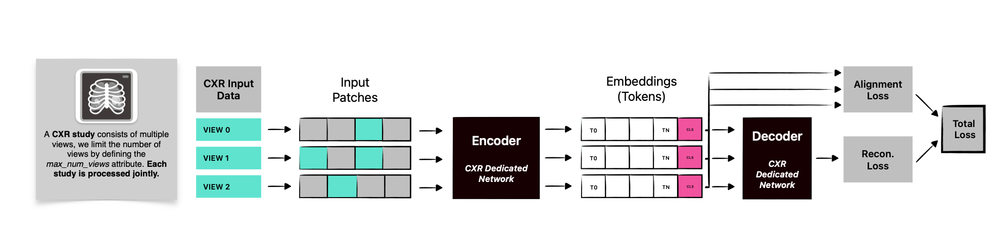
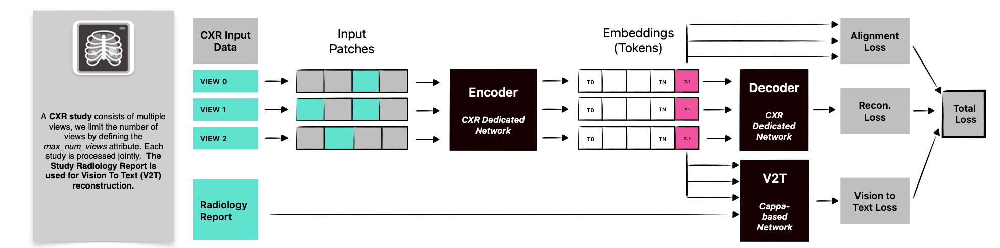
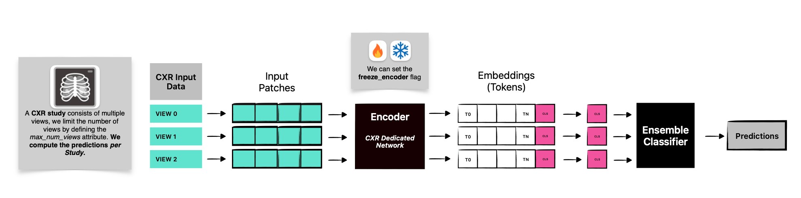

# Structure is Supervision: Multiview Masked Autoencoders for Radiology


This repository contains the implementation of **Multiview Masked Autoencoder (MVMAE)** and **MVMAE-V2T**, self-supervised frameworks for representation learning from structured medical imaging data, together with the studied baselines.  

**MVMAE** leverages the multi-view organization of radiology studies through masked reconstruction and cross-view alignment, while **MVMAE-V2T** integrates radiology reports as an auxiliary text-based signal.

All datasets can be downloaded from publicly available sources (see relevant information in the paper). The harmonization map proposed and used to acquire the labels in the Padchest dataset is stored in the  ``/utils`` directory as ``padchest_to_mimic_mapping.csv``.

---

## 1) MVMAE Pretraining

Run MVMAE pretraining with the reconstruction+alignment losses:

```bash
python main_mm_mae.py
```



---

## 2) MVMAE‑V2T (Vision‑to‑Text) Pretraining

```bash
python main_mm_mae.py --config-name=config_v2t
```

This variant augments MVMAE with a **V2T head** to learn from the paired radiology reports, adding a Vision‑to‑Text loss to the total objective.



---

## 3) Offline Evaluation

Evaluate (Full finetuning or Linear Probing) pretrained encoders with an ensemble classifier to produce study‑level predictions:

```bash
python main_mm_mae.py ++offline_eval.do_offline_eval=True ++training.do_pretraining=False
```


